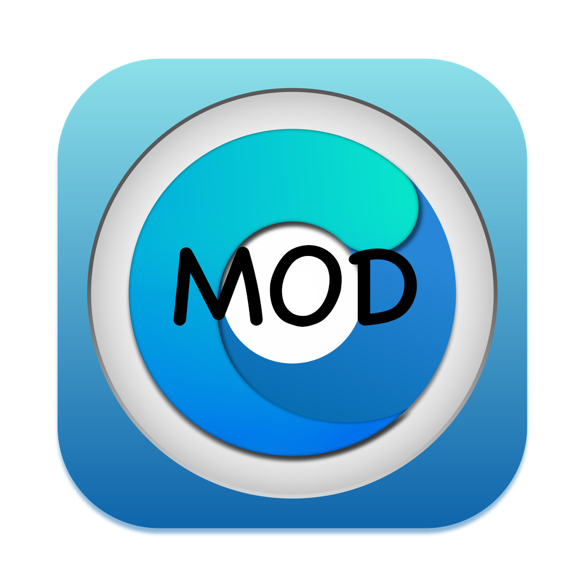

             
             <h1>OCLP-Mod</h1>

[OCLP-Mod](https://github.com/laobamac/OCLP-Mod) 是基于 Python 的修改版项目，核心基于 [Acidanthera 的 OpenCorePkg](https://github.com/acidanthera/OpenCorePkg) 和 [Lilu](https://github.com/acidanthera/Lilu)，用于在支持或不支持的 Mac 设备上运行并解锁 macOS 功能。

新增中文支持、Sequoia 系统下的英特尔无线网卡驱动、KDK/MetalLib 文件加速下载链接等功能。

----------

   [Telegram 群组](https://t.me/simplehac1)

----------

### OCLP-Mod 主要功能

* 支持 macOS Big Sur、Monterey、Ventura、Sonoma 和 Sequoia
* 原生无线（OTA）系统更新
* 支持 Penryn 及更新的 Mac 设备
* 在 BCM943224 及更新的无线芯片组上支持 WPA Wi-Fi 和个人热点
* 系统完整性保护（SIP）、FileVault 2、.im4m 安全启动和 Vaulting
* 在非原生系统上支持 Recovery OS、安全模式和单用户模式启动
* 解锁 Sidecar、AirPlay 到 Mac 等功能（原生 Mac 亦可使用）
* 为非 Apple 存储设备启用增强的 SATA 和 NVMe 电源管理
* 无需固件补丁（例如 APFS ROM 补丁）
* 支持 Metal 和非 Metal GPU 的图形加速
* 支持简体中文（zh_CN）
* 支持英特尔无线网卡（Intel Wireless）

## 支持声明

本项目以「现状」提供，不承诺对任何问题提供技术支持。但您可以通过以下社区获取帮助：

* [SimpleHac 论坛](https://www.simplehac.cn)

## 从源代码运行

如需从源代码构建并运行本项目，请参考：[从源代码构建和运行](./SOURCE.md)

## 致谢

* [Acidanthera](https://github.com/Acidanthera)
  * 提供 OpenCorePkg 及核心驱动与工具
* [Dortania](https://github.com/dortania) 和 OpenCore Legacy Patcher 贡献者
* Apple
  * 提供 macOS 及部分驱动、框架和二进制文件，我们将其适配至新版系统
